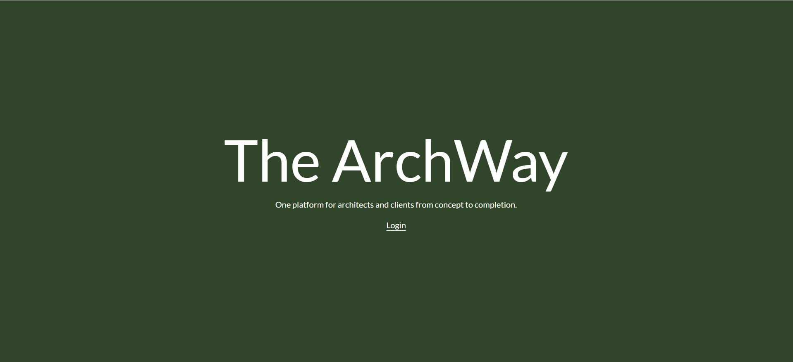

# The ArchWay - Every Phase. One Platform.

Enterprise-Grade Architectural Project Management Platform
React • Redux Toolkit • Node.js • Express • MongoDB • Google Gemini API

## Features

- Secure authentication with JWT and refresh tokens
- Role-based access for 3 user types (Client, Admin, Founder)
- AI-powered onboarding using Google Gemini API
- 7-phase construction project tracking with real-time status indicators
- Dynamic budget tracking and validation logic
- RTK Query with cache invalidation and optimistic UI updates
- Responsive design with 15+ reusable components and accessibility support
- Draft-saving system using localStorage with recovery fallback

## Table of contents

- [Overview](#overview)
- [Features](#features)
- [Key Metrics & Impact](#key-metrics--impact)
- [Tech Stack](#tech-stack)
- [Authentication & Security](#authentication--security)
- [Backend Architecture](#backend-architecture)
- [AI-Powered Communication](#ai-powered-communication)
- [Project Lifecycle Management](#project-lifecycle-management)
- [Frontend Highlights](#frontend-highlights)
- [Optimization & Reliability](#optimization--reliability)
- [Deployment & Environment](#deployment--environment)
- [Screenshots](#screenshots)
- [Links](#links)
- [Try It Locally](#try-it-locally)
- [What I Learned](#what-i-learned)
- [Continued Development](#continued-development)
- [Author](#author)

## Overview

The ArchWay is a full-stack web application built to streamline the entire lifecycle of construction and architectural projects—from Predevelopment to Close-out. Designed for architectural firms, the platform centralizes project tracking, dynamic budgeting, role-based access, and AI-powered client communication.

🔧 Replaces fragmented spreadsheets and disjointed communication with a secure, scalable platform built specifically for the architecture and construction industry.

### Key Metrics & Impact

- 80% reduction in manual administrative work via AI-powered onboarding workflows

- 95%+ delivery success rate for automated client and admin notifications

- 40% improvement in frontend performance through normalized state and render optimization

- 99% system reliability with persistent sessions, error boundaries, and graceful degradation

- 60% fewer redundant API calls using RTK Query with cache invalidation and optimistic updates

### Tech Stack

- Frontend
  - React, Redux Toolkit, RTK Query, React Router
- Backend
  - Node.js, Express
- Database
  - MongoDB
- AI & Integrations
  - Google Gemini API, EmailJS

### Authentication & Security

- JWT-based session management with refresh tokens and secure HTTP-only cookies

- Role-based access for 3 user types (Client, Admin, Founder)

- Persistent login, protected routes, and bcrypt password hashing

### Backend Architecture

- RESTful API with centralized error handling and validation

- MongoDB schemas with Map-based budget tracking per phase and client–project relationships

- Duplicate prevention, negative value rejection, and indexed queries

### AI-Powered Communication

- Google Gemini API integration for personalized onboarding emails

- 2 notification types (client welcome, admin alert) with fallback and logging

- Reduced client onboarding time from 3 days to just 2 hours with automated, AI-powered workflows

### Project Lifecycle Management

- 7-phase project tracking with real-time progress indicators

- Phase-specific budget visualization and completion percentage

- Inline alerts for overspending and missing milestones

### Frontend Highlights

- 15+ reusable components with ARIA-compliant accessibility

- Advanced form validation using 5+ regex patterns and controlled components

- Responsive UI via Bootstrap grid system

- Draft-saving system using localStorage with recovery fallback

### Optimization & Reliability

- RTK Query for efficient data fetching and cache management

- createEntityAdapter for normalized Redux state

- Optimistic updates, lean() MongoDB queries, and memoized React components

### Deployment & Environment

- Production-ready with environment-based configs

- Full CORS setup, helmet, cookie security, and error boundaries

- Clean, maintainable codebase with modular architecture

### Screenshots

### Welcome

### Login

### Project List

Admin View

Client View

Sorting Data

### Project Status

### Client Profile

### Links

- [GitHub](https://github.com/abigailjulie/TheArchWay)
- [Render](https://the-archway.onrender.com/)

## My process

### Try it Locally

# Clone the repo

git clone https://github.com/your-username/archway-project.git
cd archway-project

# Install dependencies

npm install

# Set up .env file with MongoDB URI, JWT secret, etc.

# Start the app

npm run dev

### What I learned

I deepened my understanding of optimizing data fetching, security, and role-based access control in a full-stack environment. I focused on tailoring the user experience based on role, while clearly visualizing the three key pillars of architectural project management: budget, timeline, and project phase. I also integrated AI-powered workflows to reduce unnecessary communication and improve operational efficiency.

### Continued development

I plan to integrate TensorFlow to provide a visual “health status” badge for each project: On Track, At Risk, or Behind. This will be determined using real-time data from phasePercentage, timelinePercent, and budgetUsePercent. This enhancement will provide users with immediate insight into project performance and support more informed decision-making.

## Author

- [Abigail Figaro](https://www.abigaildesigns.org)
- [LinkedIn](https://www.linkedin.com/in/abigailfigaro/)
